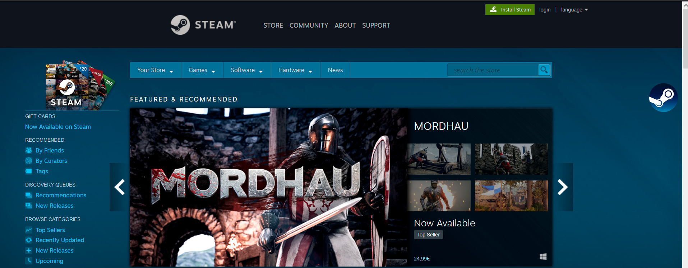
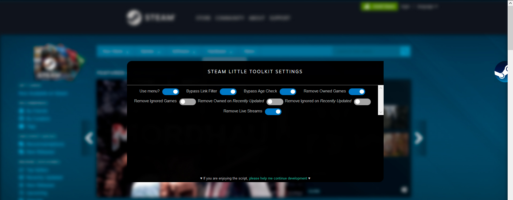
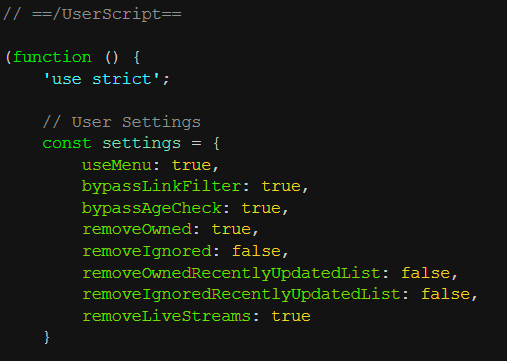

# Steam little toolkit
Tampermonkey script for the steam store that makes your experience better, works best with the [SteamDB Extension](https://steamdb.info/extension/)

**Download the script [directly](https://github.com/VoidlessSeven7/steam-little-toolkit/raw/master/steam-little-toolkit.user.js), or from [GreasyFork](https://greasyfork.org/en/scripts/386196-steam-little-toolkit)**

## Images
The menu toggler on the right

Menu toggled

You can also edit the settings manually

## List of features
- [x] Remove live streams on steam store
- [x] Remove owned/ignored games on steam store
- [x] Remove owned/ignored games on *recently updated*
- [x] Don't remove owned games while viewing bundles
- [x] Bypass age check
- [x] Bypass external link filter
- [x] Graphical menu for toggling all the settings

## To do
- [ ] Remove games when an event happens, not every **x** seconds
- [ ] Fix search so that it doesn't delete games that you own while searching
- [ ] Make the graphical menu actually work
